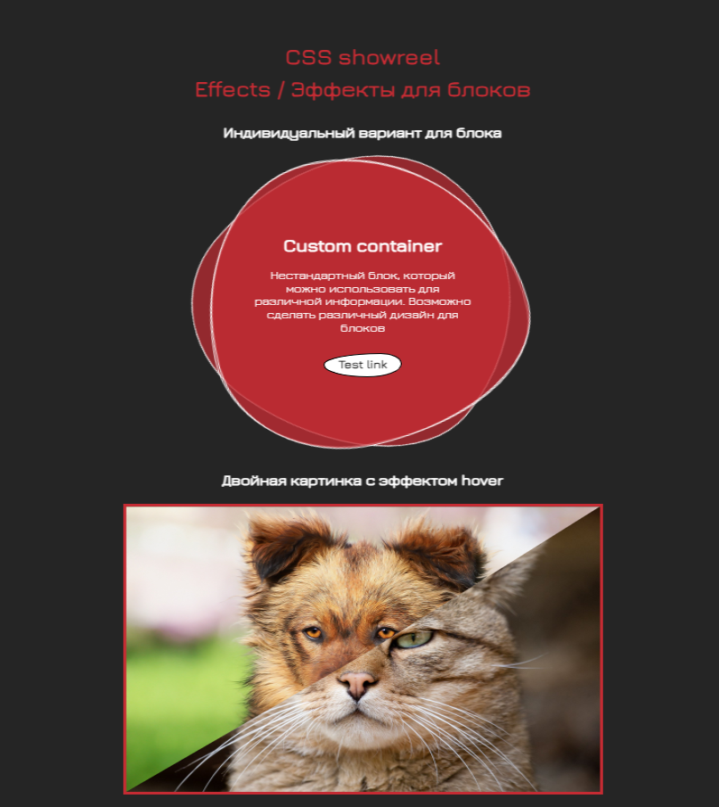

# Набор эффектов CSS

Проект на GH-pages: https://ilia-puchkov.github.io/pet-css/

Моя персональная игровая площадка CSS, где я создаю, изменяю и всячески пробую различные визуальные эффекты. 
**Цель** - создать приятный и увлекательные визуальные элементы для пользователя. 

Используемые технологии:
* CSS
* JS
* HTML

Статус: в процессе (видимо, навечно, т.к. всегда есть что добавить)

Задачи:
* добавить визуальный эффект к прокрутке страницы
* создать вариант галереи с приятным эффектом скролла
